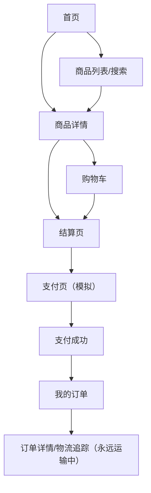

# 假买 fakeBuy — 产品需求文档（PRD）

## 1. 产品概述
假买是一个"看似真实、实则虚拟"的购物网站，模拟淘宝/京东/拼多多的完整购物体验。
- 用户可以无限挑选商品，完整走完浏览、下单、支付、查看物流的全流程；支付环节为模拟支付（无真实扣款），订单会永远显示"运输中"，包裹永不送达
- 目标用户：减压用户、剁手党戒断者、想体验购物快感但不想花钱的人；价值在于提供一种安全、零成本的"假装购物"情绪满足

## 2. 核心功能

### 2.1 用户角色
| 角色 | 注册方式 | 核心权限 |
|------|----------|----------|
| 访客（默认） | 无需注册 | 浏览商品、加入购物车、下单、模拟支付、查看订单与物流 |

> 注：本产品不做账户体系，所有数据存储于 localStorage，刷新仍在，清缓存即重置。

### 2.2 功能模块
1. **首页**：顶部导航、搜索栏、分类入口、Banner 横幅、热门推荐、为你猜你喜欢瀑布流
2. **商品列表页**：分类导航、筛选器（价格区间、品牌、销量）、排序（综合/销量/价格升降）、商品网格
3. **商品详情页**：图集轮播、价格区、规格选择（颜色/尺寸）、店铺信息、商品评价、加入购物车、立即购买
4. **购物车页**：商品清单、数量调整、单选/全选、合计金额、去结算
5. **结算页**：收货地址（默认 + 添加）、商品确认、支付方式选择、订单备注、提交订单
6. **支付页**：二维码动画、倒计时、"模拟支付完成"按钮、支付方式（支付吧/微信/银行卡均为假）
7. **支付成功页**：成功动画、订单号、查看订单/继续购物
8. **我的订单**：订单列表（全部/待付款/待发货/运输中/已完成 Tab），每条订单可点击进入详情
9. **订单详情与物流追踪**：订单信息、商品清单、物流时间轴（永远卡在"运输中"，每次进入会"模拟"出一条新的运输节点），底部隐藏彩蛋文案"您的快递将永远在路上 🚚"

### 2.3 页面详情
| 页面名称 | 模块名称 | 功能描述 |
|----------|----------|----------|
| 首页 | 顶部导航 | Logo（假买 fakeBuy）、搜索框、购物车、订单入口；吸顶 |
| 首页 | Banner 横幅 | 自动轮播，3 张主题大图（含戏谑文案：例如"零元购，真的零元"） |
| 首页 | 分类入口 | 8-10 个分类（数码、服饰、美食、家居、美妆、运动、母婴、图书等）大图标网格 |
| 首页 | 推荐瀑布流 | 商品卡片（图、标题、价、销量、店铺），无限滚动 |
| 商品列表页 | 筛选侧栏 | 价格区间双向滑块、品牌多选、销量切换 |
| 商品列表页 | 排序栏 | 综合/销量/价格升序/价格降序，激活态高亮 |
| 商品列表页 | 网格 | 4 列卡片，hover 出现快速加入购物车按钮 |
| 商品详情页 | 主图区 | 大图 + 缩略图 + 鼠标悬停放大镜效果 |
| 商品详情页 | 信息区 | 标题、副标题、价格（红字大号）、累计销量、规格选择 |
| 商品详情页 | 操作区 | 数量步进器、加入购物车（黄色边框）、立即购买（红色实心） |
| 商品详情页 | 评价区 | 模拟用户评价 5-8 条，含头像、星级、文字、晒图 |
| 购物车页 | 商品清单 | 复选框、缩略图、规格、单价、步进器、小计、删除 |
| 购物车页 | 结算栏 | 已选件数、合计金额、去结算按钮（吸底） |
| 结算页 | 地址区 | 收货地址卡片（可添加/编辑/选中） |
| 结算页 | 商品确认 | 商品清单只读、运费、优惠券（假）、总计 |
| 结算页 | 支付方式 | 支付吧 / 微信支付 / 银行卡 三选一（皆为模拟） |
| 支付页 | 支付模拟 | 二维码 + 倒计时 + "假装支付"按钮，点击后 1.5s 后跳转成功页 |
| 支付成功页 | 状态卡 | 成功对勾动画、订单号、合计金额 |
| 支付成功页 | 操作 | 查看订单 / 继续购物 |
| 我的订单 | Tab 切换 | 全部/待付款/待发货/运输中/已完成 |
| 我的订单 | 订单卡 | 订单号、下单时间、商品摘要、状态、金额、查看详情 |
| 订单详情 | 物流时间轴 | 时间倒序的物流节点，最新节点闪烁动画，永远停在"运输中" |
| 订单详情 | 彩蛋 | 底部一行小字："包裹正在前往一个永远到不了的地方" |

## 3. 核心流程

用户进入首页 → 浏览或搜索商品 → 进入商品详情 → 加入购物车或直接立即购买 → 进入购物车 → 去结算 → 选择地址与支付方式 → 进入支付页 → 点击"假装支付" → 看到支付成功 → 进入我的订单 → 查看订单详情和物流追踪（永远运输中）。

## 4. 用户界面设计

### 4.1 设计风格
**主题方向：复古杂志感的现代电商 — Editorial Commerce**

不去模仿淘宝京东的视觉密度堆砌，而是以「印刷品般的克制 + 强对比 + 戏谑感」的方式重塑购物界面。让"假买"从视觉上就传递出一丝调侃和精致。

- **主色调**：
  - 底色：奶油白 `#FAF6EE`（带轻微噪点纹理）
  - 主强调色：朱砂红 `#D63A2F`（用于价格、CTA 按钮）
  - 辅助强调色：深墨绿 `#1F3A2E`（用于次级按钮和文字）
  - 中性深色：墨灰 `#1A1A1A`（标题）
  - 提示色：芥末黄 `#E8B547`（标签、徽章）
- **按钮样式**：硬边圆角（4px），无渐变，有 1px 实线描边的"印刷感"按钮；点击有轻微下沉动效
- **字体**：
  - 中文标题：思源宋体（Noto Serif SC，700/900）— 杂志大标题感
  - 中文正文：思源黑体（Noto Sans SC，400/500）
  - 英文/数字：`Fraunces`（衬线，用于品牌名与价格）+ `Space Mono`（等宽，用于订单号、价格小数）
  - 价格字号巨大（48-72px），用 `Fraunces` 提升识别度
- **布局风格**：杂志网格 + 卡片式商品；偶尔出现倾斜或大字号文字打破规整
- **图标/Emoji**：使用 Lucide 线性图标，关键状态点配 emoji（🚚📦🛒），文案戏谑

### 4.2 页面设计概览
| 页面名称 | 模块名称 | UI 元素 |
|----------|----------|---------|
| 首页 | Hero Banner | 巨大宋体标题"假买 假装在买"，朱砂红打底，奶油白文字，左下角小字编号"NO.001"，自动 5s 切换 |
| 首页 | 分类入口 | 8 个手绘风格图标（线性，朱砂红描边）+ 中文宋体标签 |
| 首页 | 瀑布流 | 4 列卡片，白底，1px 黑色描边，图下方放大价格 + 销量小字，hover 卡片上移 4px |
| 商品列表 | 筛选栏 | 左侧固定侧栏，米色背景，分组使用宋体小标题 + 复选框 |
| 商品详情 | 主图区 | 占左侧 50%，奶油色背景，缩略图竖排，主图 hover 放大镜 |
| 商品详情 | 信息区 | 右侧 50%，巨大宋体商品名，朱砂红巨型价格 + Space Mono 小数 |
| 购物车 | 列表 | 表格布局，每行 1px 底边线，商品图正方形，数量步进器极简 |
| 结算 | 卡片 | 三段式区块，每段顶部宋体小标题+编号（01 收货地址 / 02 商品 / 03 支付） |
| 支付 | 二维码 | 中心放置模拟二维码图，下方倒计时（Space Mono），底部大按钮"假装我支付了" |
| 支付成功 | 动画 | SVG 路径绘制对勾，下方宋体"已成功 / 也未消费"双语戏谑 |
| 订单详情 | 物流时间轴 | 垂直时间轴，节点圆点（最新节点呼吸光晕），节点旁附时间 + 描述，最新节点附 🚚 |

### 4.3 响应式
桌面优先（1440px 设计稿），向下适配到 1024px、768px、375px：
- 1024px 以上：完整布局
- 768px：瀑布流 2 列，侧栏抽屉化
- 375px：单列，吸顶导航简化为汉堡 + 搜索图标

### 4.4 动效设计
- 页面切换：50ms fade + 8px 上移
- 卡片 hover：translateY(-4px) + shadow 加深，过渡 200ms
- 加入购物车：飞入动画（图片 clone 沿曲线飞到购物车图标）
- 支付成功：SVG stroke-dasharray 对勾绘制 + 卡片缩放回弹
- 物流时间轴：最新节点 1.5s 呼吸光晕循环
