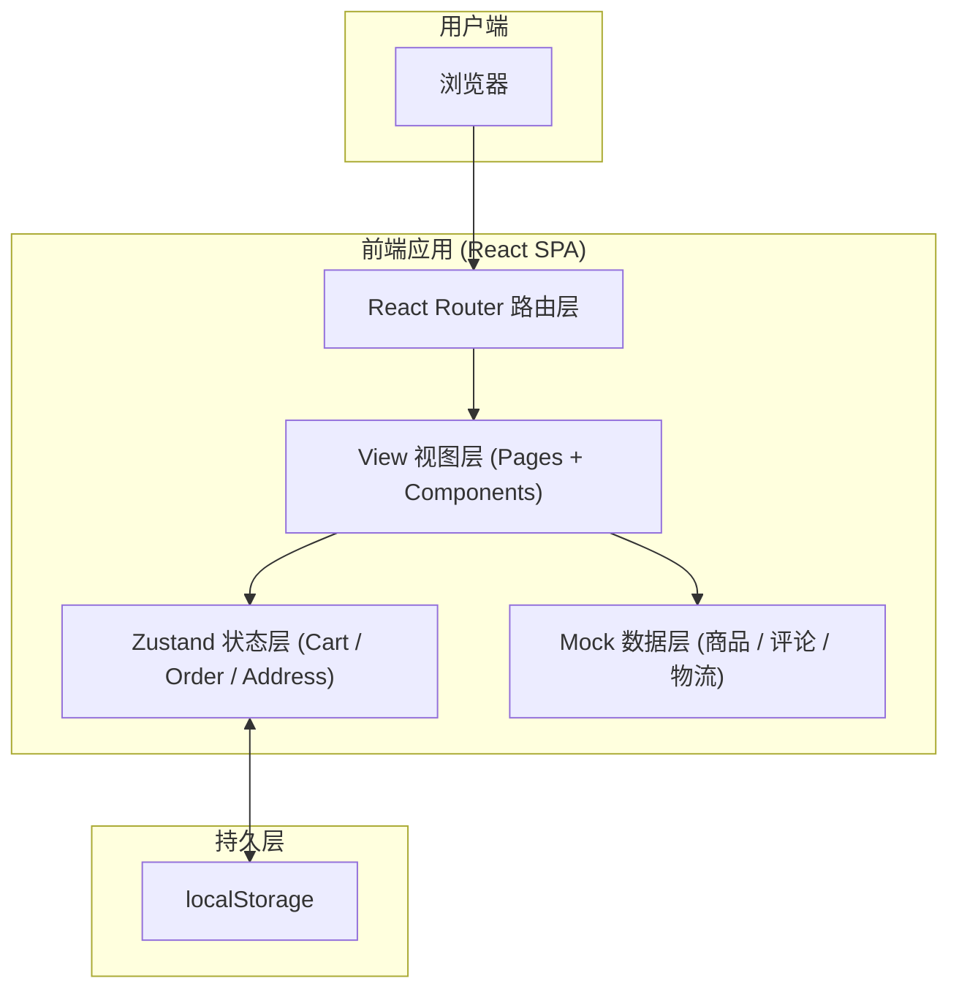

# 假买 fakeBuy — 技术架构文档

## 1. 架构设计



无后端服务，所有数据均为本地 mock 与 localStorage 持久化，模拟支付与物流通过本地定时器与状态机实现。

## 2. 技术选型

- **框架**：React 18 + TypeScript
- **构建工具**：Vite 5
- **样式**：TailwindCSS 3 + CSS Variables（主题色）+ 少量 CSS Modules（特殊动画）
- **路由**：react-router-dom 6
- **状态管理**：Zustand（轻量，自带 persist 中间件）
- **动画**：Framer Motion（页面切换、卡片 hover、对勾绘制）
- **图标**：lucide-react
- **工具**：clsx、nanoid（生成订单号）、dayjs（时间格式化）
- **字体**：通过 Google Fonts 引入 `Noto Serif SC`、`Noto Sans SC`、`Fraunces`、`Space Mono`
- **初始化工具**：Vite 官方模板 `react-ts`
- **后端**：无
- **数据库**：无；商品/评论使用静态 mock 模块，订单/地址/购物车使用 localStorage

## 3. 路由定义

| 路由 | 用途 |
|------|------|
| `/` | 首页：Banner + 分类 + 推荐瀑布流 |
| `/category/:id` | 分类列表页（含筛选/排序） |
| `/search` | 搜索结果页（query 参数 `q`） |
| `/product/:id` | 商品详情页 |
| `/cart` | 购物车 |
| `/checkout` | 结算页 |
| `/payment/:orderId` | 模拟支付页 |
| `/payment-success/:orderId` | 支付成功页 |
| `/orders` | 我的订单列表 |
| `/orders/:orderId` | 订单详情与物流追踪 |
| `*` | 404 兜底页 |

## 4. 数据契约（前端内部类型）

```typescript
// 商品
interface Product {
  id: string;
  title: string;
  subtitle?: string;
  price: number;          // 单位：元
  originalPrice?: number;
  images: string[];       // 主图集
  cover: string;          // 列表封面
  categoryId: string;
  brand: string;
  sales: number;
  rating: number;         // 0-5
  specs: { name: string; options: string[] }[]; // 颜色/尺寸
  shop: { id: string; name: string; rating: number };
  description: string[];  // 多段图文
}

// 购物车项
interface CartItem {
  id: string;             // nanoid
  productId: string;
  spec: Record<string, string>; // { 颜色: "墨绿", 尺寸: "M" }
  quantity: number;
  selected: boolean;
  snapshot: Pick<Product, 'title' | 'cover' | 'price'>;
}

// 收货地址
interface Address {
  id: string;
  name: string;
  phone: string;
  region: string;         // 省市区
  detail: string;
  isDefault: boolean;
}

// 订单
type OrderStatus = 'pending_pay' | 'paid' | 'shipped' | 'delivered_never';
interface Order {
  id: string;             // FB + 14 位时间戳 + 4 位随机
  status: OrderStatus;
  items: CartItem[];
  address: Address;
  paymentMethod: 'zfb' | 'wx' | 'bank';
  amount: { goods: number; shipping: number; discount: number; total: number };
  createdAt: number;
  paidAt?: number;
  logistics: LogisticsNode[]; // 节点累积，永远 shipped
  remark?: string;
}

interface LogisticsNode {
  time: number;
  title: string;          // "包裹离开杭州转运中心"
  desc?: string;
}

// 评论
interface Review {
  id: string;
  productId: string;
  user: { nickname: string; avatar: string };
  rating: number;
  content: string;
  images?: string[];
  createdAt: number;
}
```

## 5. 模块与目录结构

```
fakeBuy/
├── public/                       # 静态资源
├── src/
│   ├── main.tsx                  # 入口
│   ├── App.tsx                   # 路由根
│   ├── routes.tsx                # 路由表
│   ├── pages/                    # 页面级
│   │   ├── Home.tsx
│   │   ├── Category.tsx
│   │   ├── Search.tsx
│   │   ├── ProductDetail.tsx
│   │   ├── Cart.tsx
│   │   ├── Checkout.tsx
│   │   ├── Payment.tsx
│   │   ├── PaymentSuccess.tsx
│   │   ├── Orders.tsx
│   │   ├── OrderDetail.tsx
│   │   └── NotFound.tsx
│   ├── components/               # 可复用组件
│   │   ├── layout/
│   │   │   ├── Header.tsx
│   │   │   ├── Footer.tsx
│   │   │   └── PageTransition.tsx
│   │   ├── product/
│   │   │   ├── ProductCard.tsx
│   │   │   ├── ProductGrid.tsx
│   │   │   └── PriceTag.tsx
│   │   ├── common/
│   │   │   ├── Button.tsx
│   │   │   ├── QuantityStepper.tsx
│   │   │   ├── EmptyState.tsx
│   │   │   └── Stars.tsx
│   │   └── icons/
│   ├── stores/                   # Zustand
│   │   ├── useCartStore.ts
│   │   ├── useOrderStore.ts
│   │   └── useAddressStore.ts
│   ├── mock/                     # 静态数据
│   │   ├── products.ts
│   │   ├── categories.ts
│   │   ├── reviews.ts
│   │   └── logistics.ts          # 物流节点文案池
│   ├── utils/
│   │   ├── format.ts             # 价格/时间格式化
│   │   ├── id.ts                 # 订单号生成
│   │   └── logistics.ts          # 物流节点生成器
│   ├── hooks/
│   │   ├── useScrollTop.ts
│   │   └── useLogisticsTick.ts   # 模拟物流推进
│   ├── styles/
│   │   ├── index.css             # tailwind + 全局变量
│   │   └── fonts.css
│   └── types/index.ts
├── tailwind.config.ts
├── vite.config.ts
├── tsconfig.json
└── package.json
```

## 6. 关键模拟逻辑

### 6.1 模拟支付
- `/payment/:orderId` 进入后启动 5 分钟倒计时（实际可立即点击）
- 点击"假装我支付了"按钮 → 1.5s loading → 更新订单 `status: 'paid' → 'shipped'`，写入 `paidAt`，初始化 1 条物流节点 → 跳转 `/payment-success/:orderId`

### 6.2 物流推进
- 订单详情页加载时调用 `useLogisticsTick(order)`：
  - 若距离上一节点 > 10 秒（演示用），从节点池随机抽取一条新节点 push 进 `logistics` 数组
  - 节点池包含 30+ 条戏谑文案，例如：
    - "包裹在杭州转运中心打了个盹"
    - "快递员决定先去吃个午饭"
    - "您的包裹遇到了同行，开始聊天"
    - "包裹正在被反复扫描，似乎引起了关注"
- 状态永远为 `shipped`，永不变为 `delivered`

### 6.3 持久化
- `useCartStore` / `useOrderStore` / `useAddressStore` 通过 Zustand `persist` 中间件落盘到 localStorage（key: `fb_cart` / `fb_orders` / `fb_address`）
- 清空浏览器数据 = 完全重置

## 7. 性能与可移植性

- 商品图统一使用 `https://copilot-cn.bytedance.net/api/ide/v1/text_to_image` 接口动态生成（带详细中文 prompt），首屏使用 lazy loading
- 路由级代码分割（React.lazy + Suspense）
- 全局 CSS 变量定义主题色，便于换肤
- 严格 TypeScript（`strict: true`），避免运行时类型错误
- 所有 mock 模块独立、纯函数，便于后续替换为真实 API
